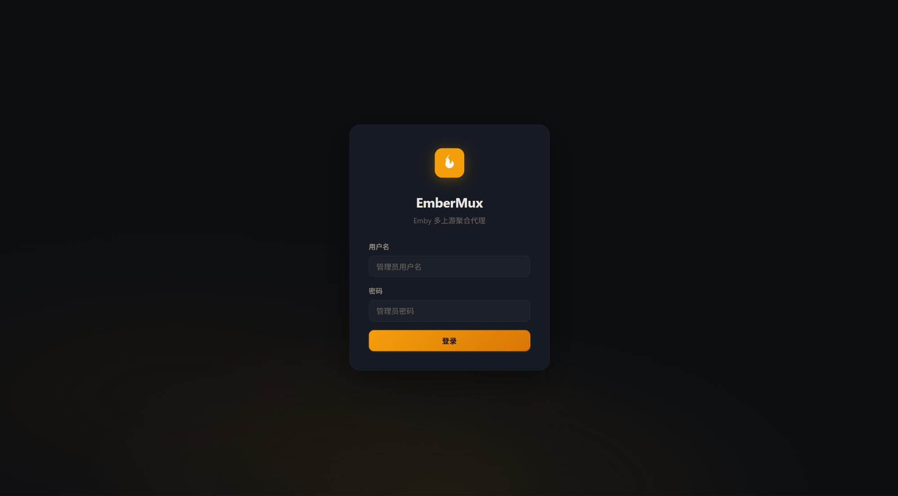
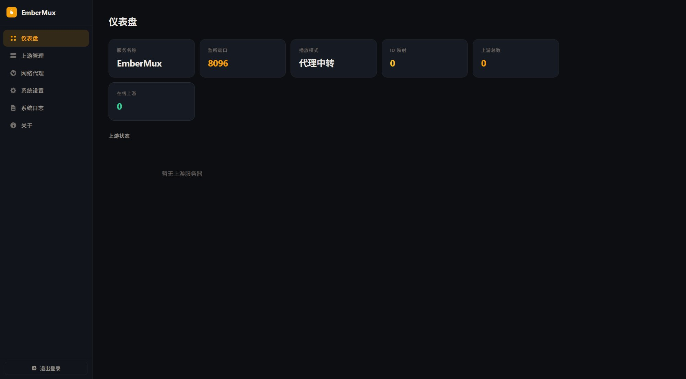

# EmberMux

Emby 多上游聚合代理 — 将多个 Emby 服务器聚合为一个统一入口，兼容所有主流客户端。

[](https://go.dev)
[](https://sqlite.org)
[](https://github.com/snnabb/embermux/actions/workflows/ci.yml)
[](https://github.com/snnabb/embermux/pkgs/container/embermux)
[](LICENSE)

## 界面预览

<!-- 截图占位，部署后访问 http://your-server:8096/admin 查看管理面板 -->

| 登录 | 仪表盘 | 上游管理 |
|:---:|:---:|:---:|
|  |  |  |

## 功能概览

| 功能 | 说明 |
|---|---|
| **多上游聚合** | 将多个 Emby 服务器合并为一个入口，自动合并媒体库 |
| **客户端兼容** | 支持 Infuse / Fileball / Emby 官方 / Forward 等主流客户端 |
| **灵活播放模式** | 代理中转 / 直连分流 / 重定向跟随，每个上游可独立设置 |
| **多播放回源** | 每个上游可配置多个播放回源地址，支持多节点 CDN 场景 |
| **ID 映射引擎** | 自动处理跨服务器的 ID 重写，客户端无感知 |
| **UA 伪装** | 内置 Infuse / Web / 客户端 三种预设，统一改写请求头 |
| **拖拽排序** | 管理面板中直接拖拽调整上游优先级 |
| **网络代理** | 支持为上游配置 HTTP/HTTPS 代理 |
| **管理面板** | Ember Glow 深色风格 Web 管理界面，全中文 |
| **单二进制** | 前端打包进二进制（embed.FS），部署只需一个文件 |

---

## 快速部署

### 一键安装（Linux）

```bash
curl -fsSL https://raw.githubusercontent.com/snnabb/embermux/main/install.sh | bash
```

脚本自动检测平台、下载最新版本、配置 systemd 服务。支持三个操作：

```bash
bash install.sh install    # 安装
bash install.sh update     # 更新
bash install.sh uninstall  # 卸载
```

> **注意**：一键脚本仅提供 `linux/amd64` 和 `darwin/arm64` 二进制。Linux ARM64 用户请使用 Docker 部署。

### Docker

```bash
docker run -d --name embermux \
  -p 8096:8096 \
  -v ./data:/app/data \
  -v ./config:/app/config \
  ghcr.io/snnabb/embermux:latest
```

或使用 Docker Compose：

```bash
git clone https://github.com/snnabb/embermux.git
cd embermux
docker compose up -d
```

Docker 镜像支持 `linux/amd64` 和 `linux/arm64` 双平台。

### 源码构建

```bash
git clone https://github.com/snnabb/embermux.git
cd embermux

# 需要 GCC（CGO 编译 SQLite）
CGO_ENABLED=1 go build -o embermux ./cmd/embermux

./embermux
```

部署完成后访问 `http://你的IP:8096/admin`，首次启动时配置文件会自动生成（一键安装会自动生成随机密码）。

---

## 配置参考

配置文件位于 `config/config.yaml`，首次启动自动生成：

```yaml
server:
  port: 8096
  name: "EmberMux"
  id: "embermux-xxxxxxxx"

admin:
  username: "admin"
  password: "your-password"

playback:
  mode: "proxy"      # proxy | direct | redirect

timeouts:
  api: 30000          # API 请求超时 (ms)
  global: 15000       # 聚合超时 (ms)
  login: 10000        # 上游登录超时 (ms)
  healthCheck: 10000  # 健康检查超时 (ms)
  healthInterval: 60000  # 检查间隔 (ms)

upstream: []
proxies: []
```

所有配置均可通过管理面板在线修改，无需手动编辑文件。

---

## 核心概念

### 播放模式

每个上游可独立设置播放模式：

| 模式 | 说明 | 适用场景 |
|---|---|---|
| **代理中转** | 媒体流量经 EmberMux 中转 | 需要隐藏上游地址、或上游不可直连 |
| **直连分流** | 客户端直接连上游播放 (302) | 上游带宽充足、不需要中转 |
| **重定向跟随** | EmberMux 服务端跟随 302 | 上游有 CDN 跳转 |

### 多播放回源

每个上游可配置多个播放回源地址（类似 Meridian 的设计）：

- 第一个地址为主播放回源
- 额外地址用于多推流/播放节点场景
- 留空时所有请求走上游主地址

### UA 伪装

三种预设模式，统一改写发送到上游的请求头：

| 模式 | 说明 |
|---|---|
| **Infuse** | 伪装为 Infuse 客户端 |
| **Web** | 伪装为 Emby Web 客户端 |
| **客户端** | 使用默认 Emby 聚合器身份 |

---

## 架构

```
┌─────────────────────────────────────────┐
│              EmberMux :8096             │
│                                         │
│  ┌───────────┐    ┌──────────────────┐  │
│  │ 管理面板   │    │   聚合代理引擎    │  │
│  │ /admin    │    │                  │  │
│  │           │    │  ID 映射 (SQLite) │  │
│  │ REST API  │    │  UA 伪装          │  │
│  │ 前端 SPA  │    │  流量代理/分流     │  │
│  └───────────┘    └──────────────────┘  │
│                          │              │
│          ┌───────────────┼──────────┐   │
│          ▼               ▼          ▼   │
│     上游 Emby 1     上游 Emby 2   Emby N │
└─────────────────────────────────────────┘

  Emby 客户端 ──► EmberMux :8096 ──► 多个上游
  管理员     ──► EmberMux :8096/admin
```

### 项目结构

```
embermux/
├── cmd/embermux/main.go        # CLI 入口
├── internal/backend/           # 后端引擎 (从 EIO 移植)
│   ├── server.go               # HTTP 路由、管理 API
│   ├── config.go               # 配置管理 (手写 YAML 解析)
│   ├── upstream_stub.go        # 上游连接管理
│   ├── idstore.go              # ID 映射 (SQLite)
│   ├── sqlite_cgo.go           # CGO SQLite 封装
│   └── ...                     # 认证、代理、健康检查等
├── web/
│   ├── embed.go                # Go embed 入口
│   └── static/                 # 前端 SPA (HTML+CSS+JS)
├── third_party/sqlite/         # SQLite 源码
├── Dockerfile
├── docker-compose.yml
├── install.sh
└── go.mod
```

### 技术选型

| 组件 | 技术 |
|---|---|
| 后端 | Go 1.22+，标准库 `net/http`（Go 1.22 新路由） |
| 前端 | 原生 HTML/CSS/JS SPA，`embed.FS` 嵌入 |
| 存储 | SQLite (CGO 源码编译)，YAML 配置 |
| 认证 | scrypt 密码哈希，Token 会话管理 |
| CI/CD | GitHub Actions：CI + 多平台 Release + Docker |

> **无外部 Go 依赖**：YAML 解析、scrypt、SQLite 均为内联实现，`go.mod` 仅声明 module 和 go 版本。

---

## 验证

```bash
# 编译（需要 GCC）
CGO_ENABLED=1 go build -o embermux ./cmd/embermux

# 测试
CGO_ENABLED=1 go test ./... -count=1

# 代码检查
go vet ./...

# 查看版本
./embermux --version

# 启动
./embermux
# 访问 http://localhost:8096/admin
```

---

## CI/CD

- 推送到 `main` 或提交 PR 自动触发 CI：`go vet` → `go test` → `go build`
- 推送 `v*` 标签自动触发 Release：
  - 构建 `linux/amd64` + `darwin/arm64` 二进制
  - 创建 GitHub Release 并上传
  - 构建并推送 Docker 镜像到 `ghcr.io`（支持 amd64 + arm64）

---

## 致谢

- [Emby-In-One](https://github.com/ArizeSky/Emby-In-One) — 后端聚合引擎
- [Meridian](https://github.com/snnabb/Meridian) — 管理面板设计参照、多播放回源设计

## License

[MIT](LICENSE)
