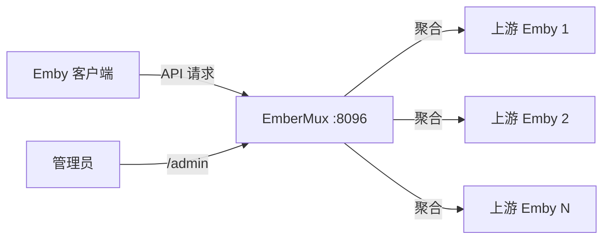

# EmberMux

Emby 多上游聚合代理 — 将多个 Emby 服务器聚合为一个统一入口，兼容所有主流客户端。

## 功能概览

| 功能 | 说明 |
|---|---|
| 多上游聚合 | 将多个 Emby 服务器合并为一个入口 |
| 客户端兼容 | 支持 Infuse / Forward / Emby 官方 / Fileball 等 |
| 灵活播放模式 | 代理中转 / 直连分流 / 重定向跟随 |
| ID 映射引擎 | 自动处理跨服务器的 ID 重写 |
| UA 伪装 | 灵活的客户端身份伪装 |
| 管理面板 | 内置 Apple TV 深色风格 Web 管理界面 |
| 网络代理 | 支持配置 HTTP/HTTPS 代理访问上游 |
| 单二进制 | 前端打包进二进制，部署只需一个文件 |

## 界面预览

> 部署后访问 `http://your-server:8096/admin` 查看管理面板

## 快速部署

### 一键安装 (Linux)

```bash
curl -fsSL https://raw.githubusercontent.com/snnabb/embermux/main/install.sh | bash
```

支持安装 / 更新 / 卸载：

```bash
bash install.sh install    # 安装
bash install.sh update     # 更新
bash install.sh uninstall  # 卸载
```

### Docker

```bash
docker compose up -d
```

或直接运行：

```bash
docker run -d --name embermux \
  -p 8096:8096 \
  -v ./data:/app/data \
  -v ./config:/app/config \
  ghcr.io/snnabb/embermux:latest
```

### 源码构建

```bash
git clone https://github.com/snnabb/embermux.git
cd embermux
go build -o embermux ./cmd/embermux
./embermux
```

## 配置参考

配置文件位于 `config/config.yaml`，首次启动自动生成：

```yaml
server:
  port: 8096
  name: "EmberMux"
  id: "embermux-xxx"

admin:
  username: "admin"
  password: "your-password"

playback:
  mode: "proxy"    # proxy | direct | redirect

timeouts:
  api: 30000
  global: 15000
  login: 10000
  healthCheck: 10000
  healthInterval: 60000

upstream: []
proxies: []
```

## 架构



## 验证

```bash
# 构建
go build -o embermux ./cmd/embermux

# 测试
go test ./... -count=1

# 代码检查
go vet ./...

# 启动
./embermux
# 访问 http://localhost:8096/admin
```

## 致谢

- [Emby-In-One](https://github.com/ArizeSky/Emby-In-One) — 后端聚合引擎
- [Meridian](https://github.com/snnabb/Meridian) — 管理面板设计参照

## License

[MIT](LICENSE)
